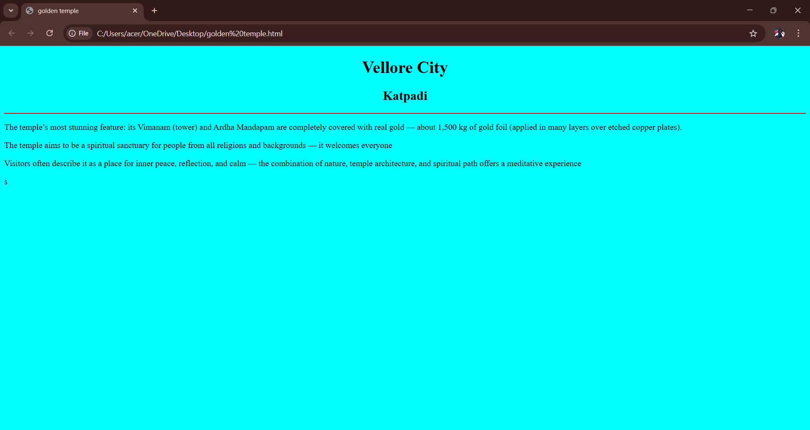

# Ex03 Places Around Me
## Name:Dhanush Rajan.T
## ref.no:25013743
## Date: 03\12\2025

## AIM
To develop a website to display details about the places around my house.

## DESIGN STEPS

### STEP 1
Create a Django admin interface.

### STEP 2
Download your city map from Google as an image.

### STEP 3
Insert the image using `````` tag and link it to the map.

### STEP 4
Using ```<map>``` tag name the map.

### STEP 5
Create clickable regions in the image using ```<area>``` tag.

### STEP 6
Write HTML programs for all the regions identified.

### STEP 7
Execute the programs and publish them.

## CODE
```
map.html


<html>
    <head>
        <title> Vellore map</title>
    </head>
    <body>
        <h1 align="center" font color="red">Vellore</h1>
        <h3 align="center" font color="blue">Dhanush Rajan.T (25013743)</h1>
        
        <br>
        

        <map name="image-map">
            <area target="" alt="vellore" title="vellore" href="vellore.html" coords="767,375,859,316" shape="rect">
            <area target="" alt="sri lakshmi narayrani golden temple" title="sri lakshmi narayrani golden temple" href="golden temple.html" coords="452,485,658,558" shape="rect">
            <area target="" alt="palamathi hills" title="palamathi hills" href="plala.html" coords="895,481,56" shape="circle">
            <area target="" alt="katpadi" title="katpadi" href="katpadi.html" coords="788,65,744,92,755,156,873,165,887,72" shape="poly">
            <area target="" alt="bagayam" title="bagayam" href="baka.html"coords="816,496,758,501,741,548,809,577,863,537" shape="poly">
        </map>

    </body>
</html>

vellore.html


<!DOCTYPE html>
<html lang="en">
<head>
    <meta charset="UTF-8">
    <meta name="viewport" content="width=device-width, initial-scale=1.0">
    <title>katpadi</title>
</head>
<body bgcolor="gray">
    <h1 align="center" font color="red">Vellore City</h1>
    <h2 align="center"font color="blue">Katpadi</h2>
    <hr font color="red">
    <p>Vellore Fort: One of the city’s most famous landmarks, built in the 16th century by the Vijayanagara Empire. It’s known for its impressive granite walls and the Jalakanteswarar Temple located inside.</p>
    <p>The city has been a notable site in India’s freedom movement—particularly the Vellore Mutiny of 1806, one of the earliest uprisings against British rule.</p>
    <p>Vellore is home to major educational institutions, including:

Vellore Institute of Technology (VIT) — one of India’s top engineering universities.

Christian Medical College (CMC) — a globally recognized medical college and hospital.</p>
</body>
</html>

katpadi.html


<!DOCTYPE html>
<html lang="en">
<head>
    <meta charset="UTF-8">
    <meta name="viewport" content="width=device-width, initial-scale=1.0">
    <title>katpadi</title>
</head>
<body bgcolor="pink">
    <h1 align="center" font color="red">Vellore City</h1>
    <h2 align="center"font color="blue">Katpadi</h2>
    <hr font color="red">
    <p>Katpadi houses Vellore Institute of Technology (VIT) — one of India’s prominent private engineering universities.</p>
    <p>

It is also known for its important railway junction: Katpadi Junction Railway Station, which is a major rail-link hub in the region, connecting Vellore / Katpadi to other parts of Tamil Nadu and beyond. 

</p>

</body>
</html>

plala.html


<!DOCTYPE html>
<html lang="en">
<head>
    <meta charset="UTF-8">
    <meta name="viewport" content="width=device-width, initial-scale=1.0">
    <title>pala</title>
</head>
<body bgcolor="orange">
    <h1 align="center" font color="red">Vellore City</h1>
    <h2 align="center"font color="blue">Katpadi</h2>
    <hr font color="red">
    <p>Palamathi Hills (also called Balamathi Hills) is part of the hilly extension of the Eastern Ghats, located on the southeastern outskirts of Vellore city.</p>
    <p>The region consists of the hilly terrain, the nearby Palamathi Reserve Forest, and a water body called Otteri Lake — together forming the Palamathi area.</p>

</body>
</html>

golden temple.html


<!DOCTYPE html>
<html lang="en">
<head>
    <meta charset="UTF-8">
    <meta name="viewport" content="width=device-width, initial-scale=1.0">
    <title>golden temple</title>
</head>
<body bgcolor="cyan">
    <h1 align="center" font color="red">Vellore City</h1>
    <h2 align="center"font color="blue">Katpadi</h2>
    <hr font color="red">
    
    <p>The temple’s most stunning feature: its Vimanam (tower) and Ardha Mandapam are completely covered with real gold — about 1,500 kg of gold foil (applied in many layers over etched copper plates).</p>
    <p>The temple aims to be a spiritual sanctuary for people from all religions and backgrounds — it welcomes everyone</p>
    <p>Visitors often describe it as a place for inner peace, reflection, and calm — the combination of nature, temple architecture, and spiritual path offers a meditative experience</p>
s</body>
</html>


baka.html


<!DOCTYPE html>
<html lang="en">
<head>
    <meta charset="UTF-8">
    <meta name="viewport" content="width=device-width, initial-scale=1.0">
    <title>katpadi</title>
</head>
<body bgcolor="light green">
    <h1 align="center" font color="red">Vellore City</h1>
    <h2 align="center"font color="blue">Katpadi</h2>
    <hr font color="red">
    <p>Bagayam is a suburb / locality in the district & urban area of Vellore in Tamil Nadu, India.</p>
    <p>Bagayam is connected by road via state highways / national highways: NH-48 and NH-132B are accessible from here.</p>

</body>
</html>


```


## OUTPUT

.png>)
<br>
.png>)
<br>
.png>)
<br>

<br>
.png>)
<br>
-1.png>)


## RESULT
The program for implementing image maps using HTML is executed successfully.
